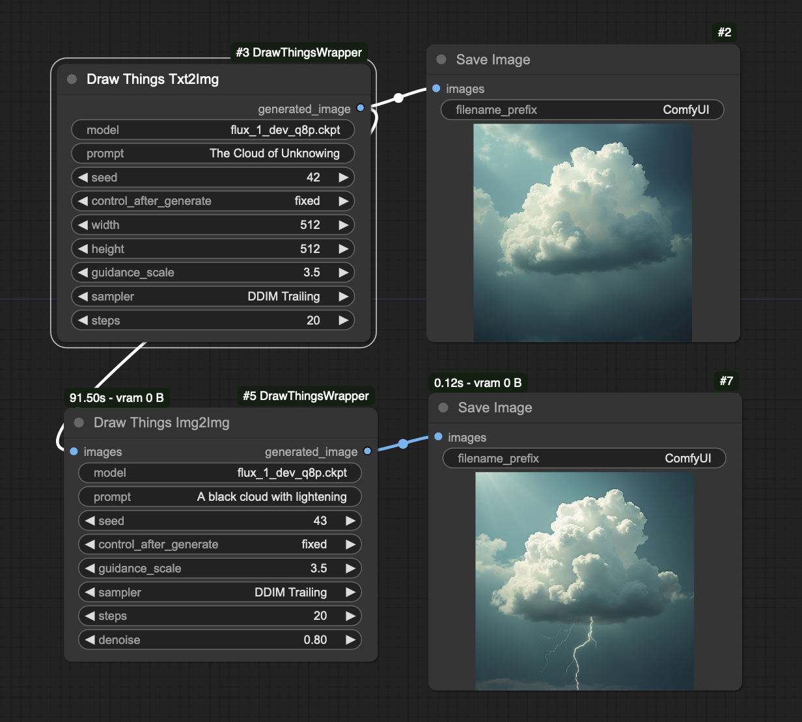

# Draw Things ComfyUI Wrapper

These nodes provide a wrapper for calling [Draw Things](https://drawthings.ai/) image generations from [ComfyUI](https://github.com/comfyanonymous/ComfyUI).

**Wait, why?** The Draw Things app has been optimized for Apple hardware and runs roughly x3 faster than ComfyUI generations. But ComfyUI is a flexible and powerful tools, and has some features - like queuing and face swapping - that haven't been implemented in Draw Things.

This simple node calls a local instance of Draw Things through its API and returns the resulting image to ComfyUI.



# Set up

**Draw Things** Start Draw Things, and in the "Advanced" tab on the left-hand side, enable "API Server" with settings Protocol HTTP, Port 7860 and IP localhost only. ComfyUI jobs can now generate via Draw Things. The generations will also display in the Draw Things as if they had been triggered natively.

**ComfyUI** Clone this repo into the ComfyUI `custom_nodes` directory and install requirements:

```
cd path/to/ComfyUI/custom_nodes/
git clone git@github.com:JosephThomasParker/ComfyUI-DrawThingsWrapper.git
cd ComfyUI-DrawThingsWrapper
pip install -r requirements.txt
```

# Limitations

This node treats Draw Things as a black box, and can only change the settings available through the [Draw Things API](https://docs.drawthings.ai/documentation/documentation/8.scripts). Settings changed through the API automatically change the values in the Draw Things UI. Other settings can be set manually inside the UI. These manual settings _do_ take effect for jobs initiated by ComfyUI, but are _not_ recorded by ComfyUI, so such ComfyUI workflows are not reproducible (without also ensuring the Draw Things settings are the same). This also means that if changes are made _only_ in the Draw Things UI, ComfyUI will not recognise that the workflow is different, and will _not_ reexecute the run.

# Disclaimer

This repo is 100% unofficial and unaffiliated with either Draw Things or ComfyUI. 


