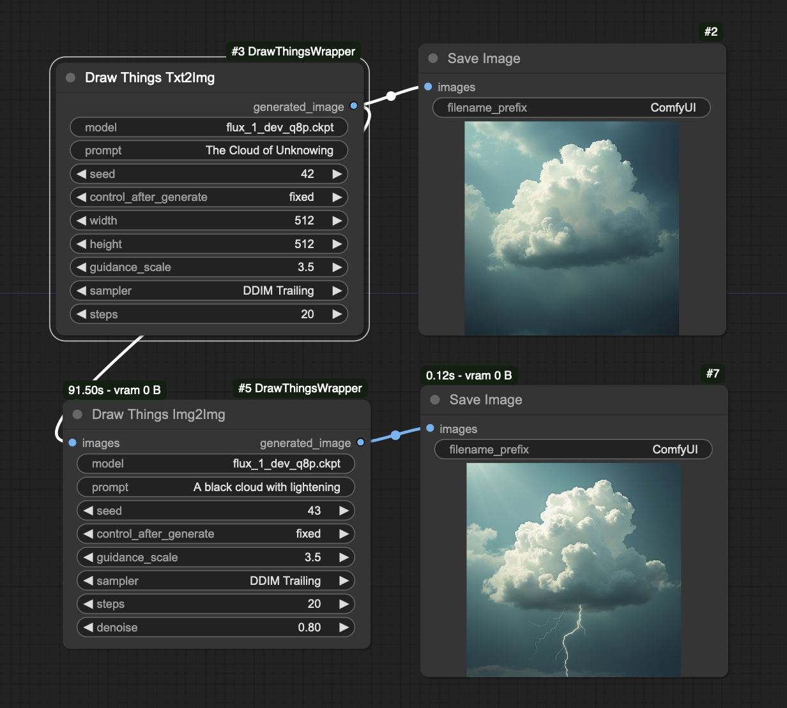
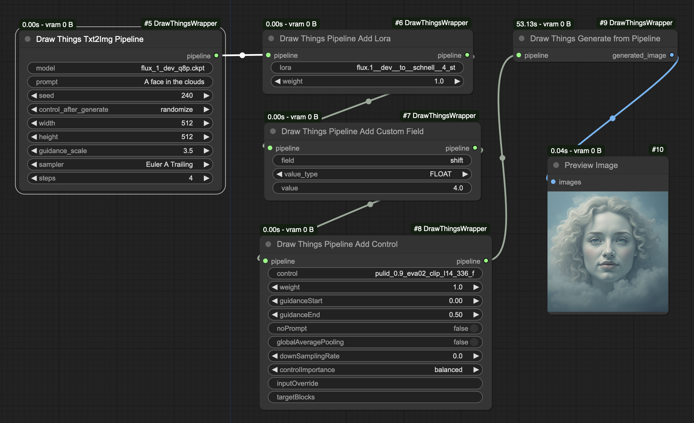

# Draw Things ComfyUI Wrapper

These nodes provide a wrapper for calling [Draw Things](https://drawthings.ai/) image generations from [ComfyUI](https://github.com/comfyanonymous/ComfyUI).

**Wait, why?** The Draw Things app has been optimized for Apple hardware and runs roughly x3 faster than ComfyUI generations. But ComfyUI is a flexible and powerful tools, and has some features - like queuing and face swapping - that haven't been implemented in Draw Things.

This simple nodes for txt2img and img2img call a local instance of Draw Things through its API and return the resulting image to ComfyUI.



# Set up

**Draw Things** Start Draw Things, and in the "Advanced" tab on the left-hand side, enable "API Server" with settings Protocol HTTP, Port 7860 and IP localhost only. ComfyUI jobs can now generate via Draw Things. The generations will also display in the Draw Things as if they had been triggered natively.

**ComfyUI** Clone this repo into the ComfyUI `custom_nodes` directory and install requirements:

```
cd path/to/ComfyUI/custom_nodes/
git clone git@github.com:JosephThomasParker/ComfyUI-DrawThingsWrapper.git
cd ComfyUI-DrawThingsWrapper
pip install -r requirements.txt
```

# Usage

## Basic usage

For basic usage, use the Txt2Img or Img2Img nodes as in the picture above. Other options like lora or controlnets can be used by setting these directly in the Draw Things app. Values set in Draw Things will be respected, unless overridden by values set in these nodes.

## Advanced usage

For more control over option setting from within ComfyUI, the **pipeline** mode can be used. In this mode, the nodes **Txt2Img Pipeline** or **Img2Img Pipeline** create the settings ("pipeline") for image generation, but unlike their basic counterparts, do not call the image generation. The image generation is done by the **Generate from Pipeline** mode, which takes a pipeline and calls the Draw Things API. Between these steps, the pipeline can be modified to set advanced options, and add lora and controlnets.



# Limitations

**Model names** must be given to the nodes exactly as they appear in the Draw Things filename. The easiest way to ensure the file names are correct is to select the desired model in Draw Things, and then click the "..." at the top by "Settings", and select "Copy configuration". Paste that text into a text editor, and the correct model and lora names will appear in the configuration. 

**Inpainting** cannot be called through these nodes.

**Controlnets, PuLID** and similar _do_ work, but image controls (e.g. openpose, reference images) must be set manually in the Draw Things app.

For **reproducibility** both the ComfyUI settings **and** the manually-set Draw Things settings must be the same

**Run triggering**. ComfyUI only triggers runs if settings in ComfyUI have changed. Changing settings only in the Draw Things app will not trigger changes.

# Implementation details

This node basically does two things: it makes a python dict of Draw Things configuration parameters, and passes that configuration to the [Draw Things API](https://docs.drawthings.ai/documentation/documentation/8.scripts) for execution.

The basic nodes do both these steps. The pipeline nodes split this into two steps, allowing for the python dict to be edited in between.

The functionality of these nodes is limited by what can be passed through the API. As I understand it, it's not possible to pass masks or control images through the API. This is what prevents inpainting from working and means that control images must be set manually in Draw Things.


# Disclaimer

This repo is 100% unofficial and unaffiliated with either Draw Things or ComfyUI. 


